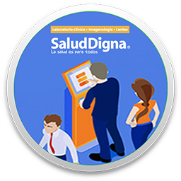
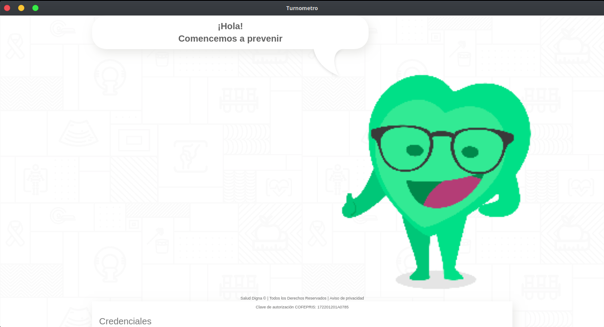
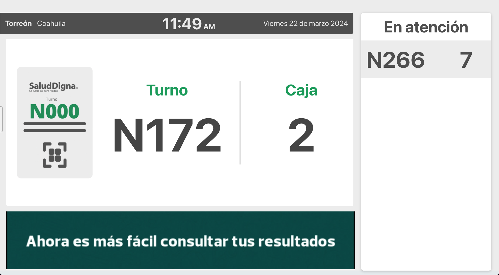

# Turnos en Pantalla Salud Digna

## ¿Qué es?
Es una aplicación para que nuestros pacientes puedan observar de manera visual el orden de atención en sucursal.

## Objetivo
Ofrecer un mejor servico a nuestros pacientes.

## Icono

## Capturas de Pantalla

## Licencia

>The [MIT license](https://opensource.org/licenses/MIT) (MIT)
>
>COPYRIGHT (C) 2024 HERIBERTO DELGADO <abrahery@gmail.com>
>
>Por la presente se concede permiso, libre de cargos, a cualquier persona que obtenga una copia de este software y de los archivos de documentación asociados (para el uso del "Software"), el Software se puede utilizar sin restricción alguna, incluidos, entre otros, los derechos de uso, copia, modificación, fusión, publicación, distribución, sublicenciar y/o venta de copias del Software, y para permitir a las personas a las que se les proporcione el Software a hacer lo mismo, sujeto a las siguientes condiciones:
>
>El aviso anterior de derechos de autor y este aviso de permiso se incluirán en todas las copias o partes sustanciales del Software.
>
>EL SOFTWARE SE PROPORCIONA "COMO ESTÁ", SIN GARANTÍA DE NINGÚN TIPO, EXPRESA O IMPLÍCITA, INCLUYENDO ENTRE OTRAS, LAS GARANTÍAS DE COMERCIABILIDAD, IDONEIDAD PARA UN PROPÓSITO PARTICULAR Y DE NO INFRACCIÓN. EN NINGÚN CASO LOS AUTORES O LOS TITULARES DE LOS DERECHOS DE AUTOR SERÁN RESPONSABLES DE NINGUNA RECLAMACIÓN, DAÑOS U OTRAS RESPONSABILIDADES, YA SEA EN UNA ACCIÓN DE CONTRATO, AGRAVIO O CUALQUIER OTRO MOTIVO, DERIVADAS DE, FUERA DE O EN RELACIÓN CON EL SOFTWARE O EL USO U OTRO TIPO DE ACCIONES EN EL SOFTWARE.
